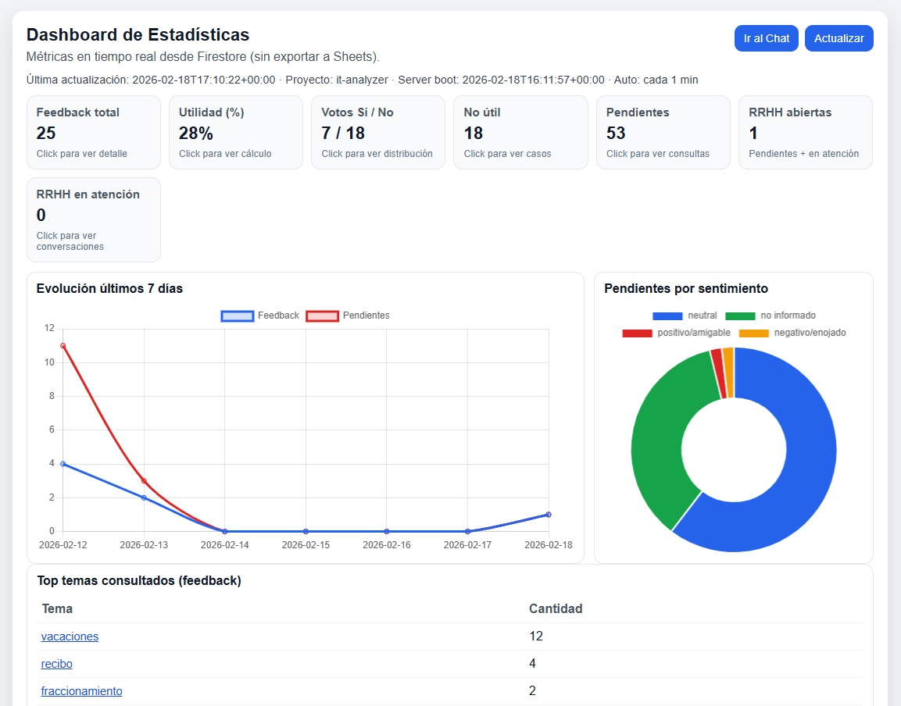
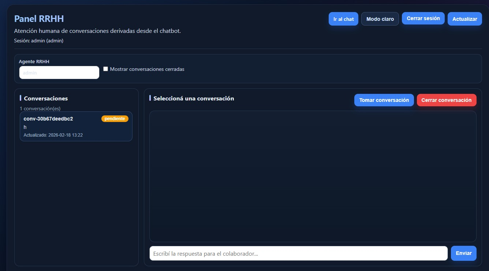
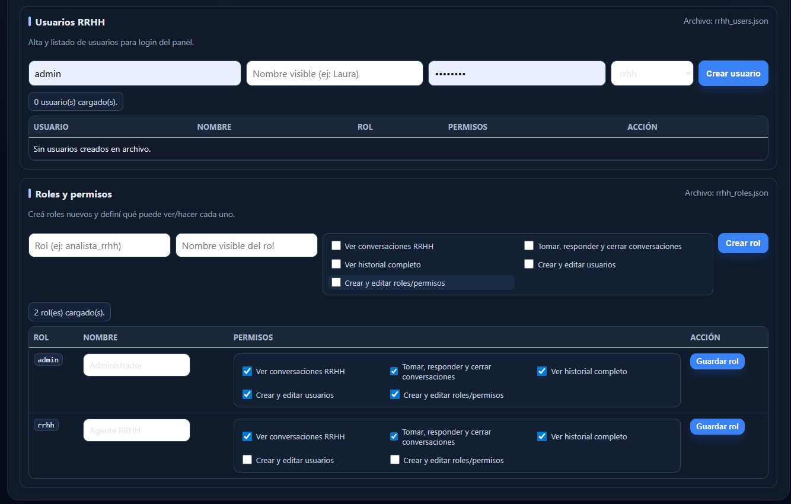

## 🏢 Asistente Virtual de RRHH Inteligente - Bacar SA
Solución integral de vanguardia para la gestión de Recursos Humanos que integra un Chatbot con Inteligencia Artificial y un ecosistema de Business Intelligence para la toma de decisiones basada en datos.

## 🚀 Funcionalidades Principales
Entendimiento Inteligente (Fuzzy Matching): Gracias a la librería TheFuzz, el bot entiende errores de ortografía y variaciones gramaticales (ej: "vacaSiones", "reCibo").

Análisis de Sentimiento (NLP): Utiliza TextBlob para detectar el estado emocional del colaborador en las consultas no resueltas.

Omnicanalidad y Escalabilidad: Arquitectura preparada para integrarse con WhatsApp y otros canales.

Persistencia en Tiempo Real: Uso de Firebase Cloud Firestore para el almacenamiento de interacciones y feedback.

## 📊 Dashboard de Monitoreo (Looker Studio)

El sistema recolecta métricas estratégicas visualizadas en tiempo real:

Tasa de Satisfacción: Basada en el feedback directo de los empleados (si/no).

Hot Topics: Mapa de calor de los temas más consultados (Vacaciones, ART, Sueldo).

Auditoría de Pendientes: RRHH puede identificar consultas fallidas y priorizarlas según el tono detectado por el análisis de sentimiento.

## 🛠️ Tecnologías y Librerías
Lenguaje: Python 3.12

Base de Datos: Firebase Admin SDK (Firestore NoSQL)

IA y Procesamiento de Lenguaje: TheFuzz (Fuzzy Matching) y TextBlob (Sentimiento)

BI: Google Looker Studio y Google Sheets

## 📁 Estructura del Proyecto

app.py: El cerebro del bot con lógica de IA y respuesta interactiva.

web_chat.py: Interfaz web local para probar conversaciones en navegador.

generar_reporte.py: Script ETL para exportar métricas de satisfacción.

extraer_pendientes.py: Auditoría y análisis de dudas no resueltas.

cargar_faqs.py: Script para la gestión y carga de la base de conocimientos.

## 🔁 Cambio de proyecto Firebase (nuevo mail/cuenta)

Para mover el chatbot al proyecto Firebase de `implementaciones.it@bacarsa.com.ar`:

1) En la consola del nuevo proyecto, creá una **Service Account Key** (JSON) y guardala localmente.
   Ejemplo: `claves-bacar.json`

2) Configurá el proyecto para usar esa clave:

```bash
export FIREBASE_CREDENTIALS=claves-bacar.json
```

3) Corré normalmente los scripts (`app.py`, `web_chat.py`, `cargar_faqs.py`, etc.).  
   Ahora se conectarán al proyecto indicado por esa clave.

### Migrar datos Firestore entre proyectos

Si querés copiar los datos del Firebase viejo al nuevo, usá:

```bash
python migrar_firestore.py \
  --source-credentials claves-viejo.json \
  --target-credentials claves-bacar.json
```

Colecciones migradas por defecto:
- `faq_rrhh`
- `feedback_respuestas`
- `consultas_pendientes`

Modo simulación (sin escribir):

```bash
python migrar_firestore.py \
  --source-credentials claves-viejo.json \
  --target-credentials claves-bacar.json \
  --dry-run
```

## 💬 Interfaz Web de Pruebas

Si querés probar el chatbot con una experiencia similar a un canal real (antes de WhatsApp), podés usar la UI web local.

1) Instalá dependencias mínimas (UI web):

```bash
python -m pip install --upgrade pip
pip install -r requirements.txt
```

Opcional (si querés todas las integraciones y reportes):

```bash
pip install -r requirements-full.txt
```

2) Ejecutá la interfaz:

```bash
python web_chat.py
```

### ⚡ Arranque rápido en Windows (proyecto `it-analyzer`)

Si trabajás en Windows y querés dejar todo listo en un comando (venv + dependencias + variables + run):

1) Copiá tu Service Account JSON en la raíz del repo como `claves.json`.

2) En PowerShell, ejecutá:

```powershell
Set-ExecutionPolicy -Scope Process -ExecutionPolicy Bypass
.\iniciar_windows_it_analyzer.ps1
```

Opcional (credencial con otro nombre):

```powershell
.\iniciar_windows_it_analyzer.ps1 -CredPath "mi-clave-firebase.json"
```

Este script configura automáticamente:
- `GOOGLE_CLOUD_PROJECT=it-analyzer`
- `FIREBASE_PROJECT_ID=it-analyzer`
- `RRHH_AUTH_ENABLED=true`
- usuario/clave admin local por defecto para panel RRHH

### 🚀 Deploy rápido Firebase + Cloud Run (Windows)

También podés desplegar en un comando con:

```powershell
Set-ExecutionPolicy -Scope Process -ExecutionPolicy Bypass
.\deploy_firebase_cloudrun.ps1 -ProjectId "it-analyzer" -AdminUser "admin" -AdminPassword "tu-clave-segura" -WebSecret "secreto-largo"
```

Si tu usuario no tiene permisos IAM para crear service accounts, podés desplegar usando la cuenta por defecto:

```powershell
.\deploy_firebase_cloudrun.ps1 -ProjectId "it-analyzer" -UseDefaultServiceAccount
```

Si además tu usuario no puede habilitar APIs (error `serviceusage.services.enable`), usá:

```powershell
.\deploy_firebase_cloudrun.ps1 -ProjectId "it-analyzer" -UseDefaultServiceAccount -SkipApiEnable
```

> En ese caso, las APIs deben estar habilitadas previamente por un owner/admin del proyecto.

Opcional (si además querés Firebase Hosting con rewrite a Cloud Run):

```powershell
.\deploy_firebase_cloudrun.ps1 -ProjectId "it-analyzer" -UseHosting
```

Si querés publicar **solo en debo-chat** (sitio que se usa siempre):

```powershell
.\deploy_firebase_cloudrun.ps1 -ProjectId "it-analyzer" -UseHosting -HostingSite "debo-chat"
```

O con Firebase CLI directo: `firebase deploy --only hosting:debo-chat`

> Requisitos: `gcloud` y (si usás hosting) `firebase` instalados y autenticados en tu sesión.

3) Abrí en tu navegador:

```text
http://localhost:5000
```

Funciones disponibles en la UI:
- Chat en tiempo real con el motor del bot.
- Flujo de feedback (si/no) integrado.
- Botones rápidos: menú, hablar con RRHH y reiniciar sesión.
- Atajos clickeables por número/tema y sugerencias de preguntas.
- Vista de estadísticas en tiempo real: `http://localhost:5000/estadisticas`
- Historial completo de chats: `http://localhost:5000/historial`
- Panel RRHH con temas de color mejorados y switch claro/oscuro.
- Panel de configuración separado para empresa, usuarios y roles: `http://localhost:5000/configuracion`

## ☁️ Deploy en Render (producción)

Para producción, usá Gunicorn en lugar del servidor de desarrollo de Flask:

1) **Build Command**:

```bash
pip install -r requirements.txt -r requirements-full.txt
```

2) **Start Command**:

```bash
gunicorn web_chat:flask_app --bind 0.0.0.0:$PORT --workers 2 --threads 4 --timeout 120
```

3) **Variables de entorno mínimas**:

```bash
CHATBOT_WEB_SECRET=una-clave-larga-y-segura
RRHH_AUTH_ENABLED=true
RRHH_ADMIN_USER=admin
RRHH_ADMIN_PASSWORD=una-clave-segura
```

4) **Firebase en Render (recomendado)**:
- Cargá la clave como **Secret File** con nombre `claves.json`.
- Configurá:

```bash
FIREBASE_CREDENTIALS=/etc/secrets/claves.json
```

5) **Persistencia de usuarios/roles RRHH** (opcional, recomendado):
- Agregá un Persistent Disk y montalo, por ejemplo, en `/var/data`.
- Configurá:

```bash
RRHH_USERS_FILE=/var/data/rrhh_users.json
RRHH_ROLES_FILE=/var/data/rrhh_roles.json
```

## 🔥 Deploy en Firebase + Cloud Run (sin Render)

Si te piden usar stack Google/Firebase completo, esta app se despliega así:

- **Backend Python (Flask/Gunicorn)** en **Cloud Run**
- **Base de datos** en **Firestore**
- **(Opcional) dominio/capa web** en **Firebase Hosting** con rewrite a Cloud Run

> Importante: Firebase Hosting **solo** no ejecuta Python.
> Para este proyecto, el runtime va en Cloud Run.

### 1) Preparar proyecto GCP/Firebase

```bash
gcloud auth login
gcloud config set project TU_PROJECT_ID
gcloud services enable run.googleapis.com cloudbuild.googleapis.com artifactregistry.googleapis.com firestore.googleapis.com
```

### 2) (Recomendado) crear service account para Cloud Run

```bash
gcloud iam service-accounts create chatbot-rrhh-run --display-name="Cloud Run Chatbot RRHH"
gcloud projects add-iam-policy-binding TU_PROJECT_ID \
  --member="serviceAccount:chatbot-rrhh-run@TU_PROJECT_ID.iam.gserviceaccount.com" \
  --role="roles/datastore.user"
```

Con eso la app puede leer/escribir Firestore sin `claves.json` manual.

### 3) Deploy a Cloud Run (usa `Dockerfile` del repo)

```bash
gcloud run deploy chatbot-rrhh \
  --source . \
  --region southamerica-east1 \
  --platform managed \
  --allow-unauthenticated \
  --service-account chatbot-rrhh-run@TU_PROJECT_ID.iam.gserviceaccount.com \
  --set-env-vars CHATBOT_WEB_SECRET=clave-larga-segura,RRHH_AUTH_ENABLED=true,RRHH_ADMIN_USER=admin,RRHH_ADMIN_PASSWORD=clave-segura
```

Al finalizar, Cloud Run te devuelve la URL pública.

### 4) (Opcional) poner Firebase Hosting delante de Cloud Run

1. Inicializá hosting:

```bash
firebase login
firebase use --add
firebase init hosting
```

2. En `firebase.json`, agregá rewrite al servicio de Cloud Run:

```json
{
  "hosting": {
    "public": "hosting",
    "ignore": ["firebase.json", "**/.*", "**/node_modules/**"],
    "rewrites": [
      {
        "source": "**",
        "run": {
          "serviceId": "chatbot-rrhh",
          "region": "southamerica-east1"
        }
      }
    ]
  }
}
```

3. Deploy (siempre solo al sitio **debo-chat**):

```bash
firebase deploy --only hosting:debo-chat
```

> No usar `firebase deploy --only hosting` (despliega todos los sitios). El sitio que se usa es **debo-chat.web.app**.

### 5) Nota importante sobre usuarios/roles en Cloud Run

Cloud Run no ofrece disco persistente como Render Disk.  
Por eso:

- si usás `rrhh_users.json` / `rrhh_roles.json`, no garantizan persistencia entre reinicios
- para producción en Cloud Run, usá al menos admin por variables de entorno (`RRHH_ADMIN_*`)
- si necesitás multiusuario persistente desde el panel, conviene migrar usuarios/roles a Firestore

## 👩‍💼 Derivación y atención humana (RRHH)

Cuando un colaborador pide “hablar con RRHH”, la conversación se deriva a una bandeja de atención humana.

- Panel RRHH: `http://localhost:5000/rrhh`
- Bandeja de conversaciones pendientes/activas.
- Asignación automática de chats entre agentes RRHH activos (balanceo básico).
- Botón para tomar conversación por agente.
- Reasignación manual de conversaciones entre agentes activos.
- Respuesta en vivo desde RRHH al colaborador en el mismo chat.
- Cierre de conversación por RRHH o colaborador.

### 🏢 Configuración para múltiples empresas

El chatbot permite personalizar branding y contacto RRHH para usarlo en distintas compañías.

Opciones:

1) Variables de entorno:

```bash
export CHATBOT_COMPANY_NAME="Mi Empresa"
export CHATBOT_HR_TEAM_NAME="RRHH"
export CHATBOT_HR_CONTACT="interno 123"
```

2) Panel web de configuración (recomendado para operación diaria):

- URL: `http://localhost:5000/configuracion`
- Sección **Empresa y branding** para editar:
  - Nombre de empresa
  - Nombre del equipo RRHH
  - Contacto RRHH
  - (Opcional) Email, dirección, teléfono y sitio web de la empresa

### 🔐 Usuarios para panel RRHH e historial

Ahora podés proteger `GET /rrhh`, `GET /historial` y sus APIs (`/api/rrhh/*`, `/api/historial`) con login.

1) Activá autenticación:

```bash
export RRHH_AUTH_ENABLED=true
```

2) Elegí una de estas opciones de usuarios:

- **Usuario admin por variables de entorno**:

```bash
export RRHH_ADMIN_USER=rrhh
export RRHH_ADMIN_PASSWORD="cambiame-por-una-segura"
```

- **Archivo con múltiples usuarios** (`rrhh_users.json`):
  - Tomá como base `rrhh_users.example.json`.
  - Definí la ruta (opcional, por defecto busca `rrhh_users.json`):

```bash
export RRHH_USERS_FILE=rrhh_users.json
```

Para generar hash de contraseña (recomendado):

```bash
python auth_rrhh.py --hash "mi-clave-segura"
```

Luego pegá ese valor en `password_hash`.

### Crear usuarios desde la interfaz web (sin editar JSON)

Con autenticación activa:

1) Ingresá con un usuario **admin** en `http://localhost:5000/login`.  
   (si usás `RRHH_ADMIN_USER`, por defecto queda con rol `admin`)

2) Entrá al panel `http://localhost:5000/configuracion`.

3) En la sección **Usuarios RRHH**:
   - completá usuario, nombre visible, contraseña y rol
   - podés cargar datos opcionales: email, teléfono y área
   - hacé click en **Crear usuario**
   - para modificar usuario, editá sus campos y hacé click en **Guardar cambios**
   - en la columna **Permisos** ves qué puede ver/hacer cada usuario según su rol

Eso guarda automáticamente en `RRHH_USERS_FILE` (por defecto `rrhh_users.json`).

### Restablecer contraseña por email

Para que **le llegue el correo a la persona** que recupera la contraseña, tenés que configurar SMTP.

**Dos formas de usar el reset:**

1. **Recuperar contraseña (la persona)**  
   En la pantalla de login, "Restablecela por email" → `/recuperar-clave`. La persona ingresa usuario y email; si coinciden con los datos del usuario, se genera un enlace y **se envía a ese email** (si SMTP está configurado). Si SMTP no está configurado, el enlace se muestra en pantalla para copiarlo.

2. **Enviar reset desde Configuración**  
   En `Configuración -> Usuarios`, el botón **Enviar reset** genera el enlace y lo envía al email del usuario (si SMTP está configurado).

**Configuración SMTP (obligatoria para que el mail llegue):**

Podés usar variables de entorno o un archivo `.env` (copiá `.env.example` a `.env` y completá los valores):

```bash
# Opción 1: variables de entorno
export SMTP_HOST="smtp.tu-proveedor.com"
export SMTP_PORT="587"
export SMTP_USER="no-reply@tu-dominio.com"
export SMTP_PASSWORD="tu-clave-smtp"
export SMTP_FROM="no-reply@tu-dominio.com"
export SMTP_USE_TLS="true"

# Opción 2: archivo .env (instalá python-dotenv: pip install python-dotenv)
# Copiá .env.example a .env y editá SMTP_HOST, SMTP_USER, SMTP_PASSWORD, etc.
```

Ejemplos por proveedor:

- **Gmail:** `SMTP_HOST=smtp.gmail.com`, `SMTP_PORT=587`. Usar [Contraseña de aplicación](https://support.google.com/accounts/answer/185833), no la contraseña normal.
- **Outlook/Office 365:** `SMTP_HOST=smtp.office365.com`, `SMTP_PORT=587`.
- **SendGrid:** `SMTP_HOST=smtp.sendgrid.net`, `SMTP_USER=apikey`, `SMTP_PASSWORD=<tu API key>`.

Ruta del link que recibe el usuario: `/restablecer-clave/<token>`

### Roles personalizados y permisos

Además de `admin` y `rrhh`, podés crear roles propios desde el panel:

- Sección **Roles y permisos** en `http://localhost:5000/configuracion`
- Crear rol nuevo con permisos
- Editar permisos de roles existentes

Permisos disponibles:
- `conversaciones_ver`: ver panel/bandeja RRHH
- `conversaciones_gestionar`: tomar, responder y cerrar conversaciones
- `historial_ver`: acceder al historial completo
- `usuarios_gestionar`: crear/editar usuarios
- `roles_gestionar`: crear/editar roles y permisos

Roles por defecto:
- `admin`: todos los permisos
- `rrhh`: conversaciones + historial (sin gestión de usuarios/roles)

Archivo de roles (opcional):

```bash
export RRHH_ROLES_FILE=rrhh_roles.json
```

## 🧾 Historial completo de conversaciones

Se guarda cada mensaje en la colección `chat_historial`:
- colaborador
- bot
- rrhh
- sistema

Consultas disponibles:
- Página visual: `GET /historial`
- API: `GET /api/historial` (filtros por remitente/canal/conversación/texto)

## 📈 Dashboard Web (sin Google Sheets)

El proyecto incluye una página de métricas conectada directo a Firestore para no depender de exportaciones manuales:

- Endpoint JSON: `GET /api/stats`
- Página visual: `GET /estadisticas`

Métricas incluidas:
- Total de feedback y porcentaje de utilidad.
- Votos sí/no.
- Casos "No útil" con detalle clickeable.
- Pendientes por sentimiento.
- Evolución de feedback y pendientes (últimos 7 días).
- Top temas consultados.
- Estado de derivaciones RRHH (abiertas, en atención, cerradas).
- Drill-down interactivo: podés hacer click en KPIs, temas y gráficos para ver detalle.
- Auto-refresco cada 1 minuto (sin cache del navegador).

Tip de diagnóstico: en la parte superior del dashboard se muestra el `Proyecto` y `Server boot`.
Si no cambian, probablemente seguís con una instancia vieja de `web_chat.py`.






