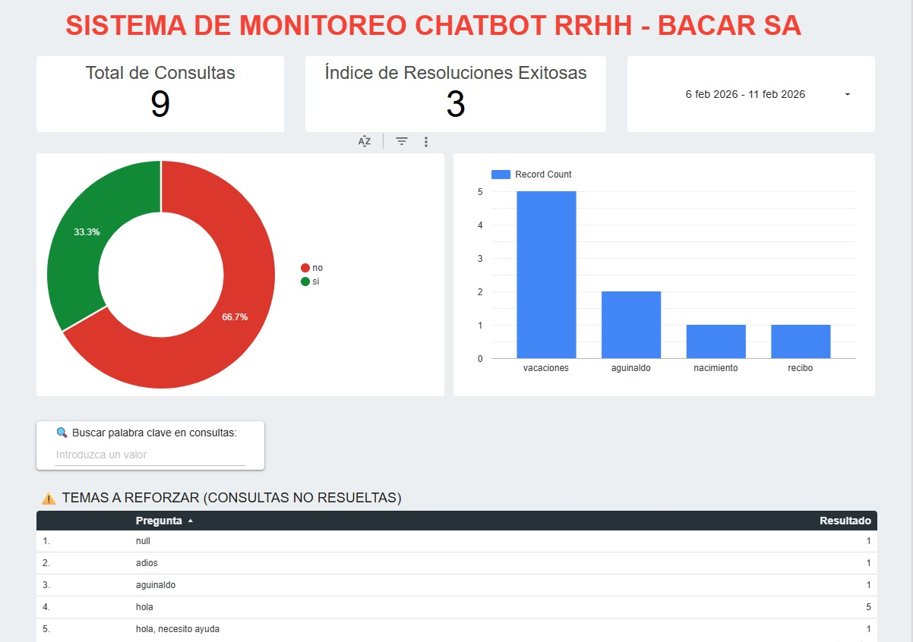

## 📊 Business Intelligence & Monitoreo

Solución integral de automatización para el departamento de Recursos Humanos de Bacar SA. El proyecto integra un Chatbot interactivo con un ecosistema de Business Intelligence para la toma de decisiones basada en datos.

🚀 Tecnologías Utilizadas
Backend: Python con integración de Firebase Admin SDK.

Base de Datos: Google Firebase Cloud Firestore (NoSQL).

Visualización: Google Looker Studio para monitoreo de KPIs.

📊 Dashboard de Monitoreo e Inteligencia
El sistema no solo resuelve dudas, sino que captura métricas estratégicas en tiempo real:

Tasa de Satisfacción: Seguimiento de respuestas útiles mediante feedback directo.

Hot Topics: Análisis de los temas más consultados (Vacaciones, ART, Sueldo).

Mejora Continua: Registro automático de consultas no entendidas para alimentar la base de conocimientos.

🛠️ Estructura del Repositorio
app.py: Lógica principal del chatbot interactivo.

generar_reporte.py: Script para exportar datos de feedback a Google Sheets.

extraer_pendientes.py: Extractor de dudas no resueltas para auditoría de RRHH.

cargar_faqs.py: Administrador de carga masiva de la base de conocimientos.

Solución de vanguardia para la gestión de RRHH que integra un Chatbot con procesamiento de lenguaje natural y un ecosistema de Business Intelligence.

## 🚀 Nuevas Funcionalidades Inteligentes
- **Fuzzy Matching (TheFuzz):** El bot ahora entiende errores de ortografía y variaciones gramaticales (ej: "vacaSiones", "reCibo").
- **Análisis de Sentimiento (TextBlob):** Capacidad de detectar el estado emocional del colaborador en consultas no resueltas.
- **Arquitectura NoSQL:** Persistencia de datos en tiempo real con Firebase Cloud Firestore.

## 📊 Dashboard de BI (Looker Studio)
El sistema recolecta métricas estratégicas para la toma de decisiones:
- **Nivel de Satisfacción:** Basado en el feedback directo de los empleados.
- **Mapa de Calor de Consultas:** Identificación de los temas más críticos.
- **Priorización por Sentimiento:** RRHH puede identificar consultas urgentes o de colaboradores frustrados mediante el análisis de tono.

## 🛠️ Tecnologías y Librerías
- **Python 3.12** (Lógica principal)
- **Firebase Admin SDK** (Base de datos)
- **TheFuzz** (Similitud de palabras)
- **TextBlob** (Análisis de sentimiento)

## 📁 Estructura del Proyecto
- `app.py`: El cerebro del bot con lógica de IA.
- `generar_reporte.py`: Extractor de datos para el Dashboard.
- `extraer_pendientes.py`: Auditoría de consultas fallidas.
